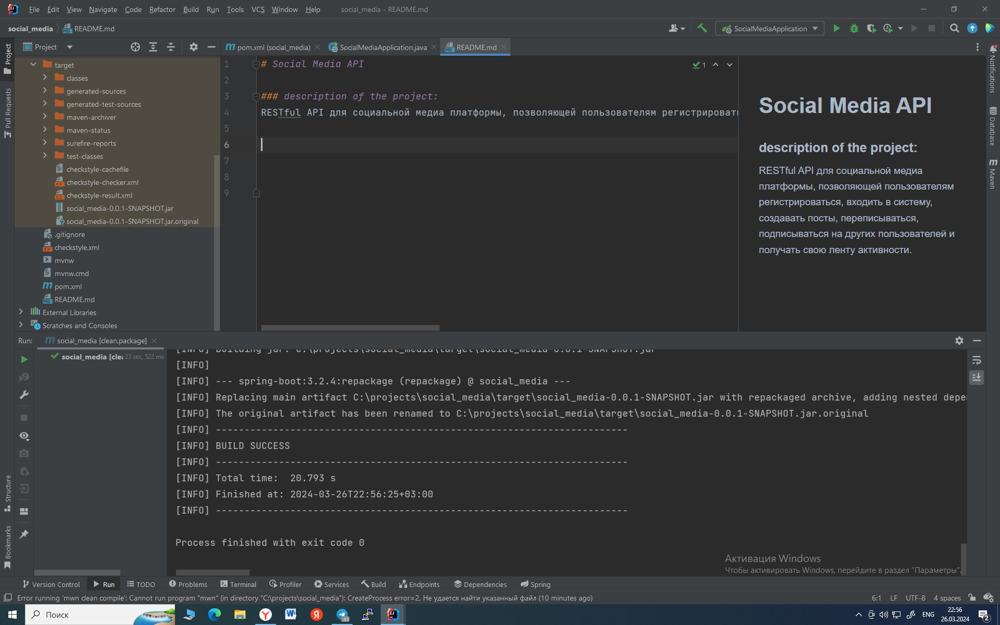

# Social Media API

### description of the project:
RESTful API для социальной медиа платформы, позволяющей пользователям регистрироваться, входить в систему, создавать посты, переписываться, подписываться на других пользователей и получать свою ленту активности.

Состояние сборки проекта:

